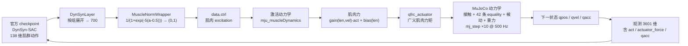

# 技术路线

本文说明本工作区的**技术选择与理由**（为什么这么做、边界在哪里）。
实验数据、验证证据与逐项结论见 [`reports/phase1_report.md`](../reports/phase1_report.md)。

## 一句话路线

用官方 **MS-Human-700** 全身肌骨模型（700 块肌肉）+ **msgym** 的 Gymnasium 环境
+ 官方 **DynSyn-SAC** 预训练策略，在 **MuJoCo 真实动力学**下做偏瘫肌力研究；
本研究新增独立后端 `hemirl/`，**不触碰**原 `muscle-pt` 项目
（BIO 模型、患者 BVH 处理与分析功能保持不变）。

## 闭环数据流

每一环都有实测证据（公式同状态误差 0.0、`qfrc_applied`/`xfrc_applied` 恒为 0、
零动作时躯体因重力下落），详见 `reports/dynamics_audit.json` 与
`reports/phase1_report.md` §5。

## 三层技术选择

| 层次 | 选择 | 理由 | 代码 |
|---|---|---|---|
| **仿真后端** | MuJoCo 3.11（CPU）+ gymnasium + msgym `LocomotionFullEnv-v1` | 官方环境，动作/观测接口与 checkpoint 严格一致；推理不需 GPU | `hemirl/envs.py` |
| **控制方式** | 复用官方 DynSyn-SAC 权重，**不改动作/观测接口** | 保证复现可信；新增观测只能放进后续重训的独立配置 | `hemirl/policy.py`、`hemirl/wrappers.py` |
| **肌力损伤建模** | **运行时修改编译后 `MjModel` 的 F0 字段**（`gainprm[2]` / `biasprm[2]`） | 不派生 XML、不改 `external/`；可从不可变基准快照反复设置，杜绝累乘 | `hemirl/muscle_actuator.py` |

## 关键工程决策

1. **肌力缩放语义**：$F0_i = \alpha_g \cdot F0_{i,\text{baseline}}$，`g` 为肌肉所属组；
   上下肢与左右侧**独立**缩放。区分两种模式：
   `active_only`（仅主动产力能力下降）与 `active_and_passive`（主动 + 被动力共同缩放）。
   不碰长度/时间参数（`lengthrange`、`scale`、`lmin/lmax`、`vmax`、`timeconst`），
   也不把关节刚度、阻尼或策略动作幅值当作"最大等长力"。

2. **分组映射双证据链**：权威分组取官方源文件
   `Muscle/Muscle_{Leg,Arm,Arm_Hand,Torso}_{r,l}.xml`（50/50 下肢、61/61 上肢、478 躯干）；
   几何侧用"tendon 跨越的关节"交叉验证。192 块不跨越可动关节的肌肉（该简化模型脊柱多段刚性连接）
   与 44 块"权威归躯干、仅跨上肢关节"的肩胛带肌肉都**逐条标注**而非静默处理，
   后者可用 `include_shoulder_girdle=True` 显式纳入上肢组。清单见
   `reports/muscle_group_map.csv`。

3. **终止规则分离**：官方"偏离参考姿态即终止"只在 `--termination official` 复现时使用；
   研究模式改用物理条件（骨盆高度、骨盆直立偏差、根节点速度、数值异常、超时）。
   构造函数直接拒绝 `allow_reference_deviation_termination=True`，从代码层面防止预设。
   见 `hemirl/termination.py`。

4. **真伪动力学可核查**：`kinematic_play` 被强制为 `False`（`hemirl/envs.py` 拒绝 `True`）；
   运行时断言 `qfrc_applied`/`xfrc_applied` 为零；肌肉力公式做同状态一致性检验。
   见 `hemirl/dynamics_audit.py`。

5. **每次运行落 provenance**：仓库 commit、checkpoint 来源与 SHA-256、依赖版本、
   随机种子与实验参数，写入 `runs/<tag>/run.json`。见 `hemirl/provenance.py`。

6. **不做预设**：不在奖励、数据处理或结果展示中假定"患侧辅助最终更好"——临界点是待检验假设。
   相关约定写在 `AGENTS.md` 的硬性规则中。

## 与旧路线（`muscle-pt`）的差异

| 维度 | 旧项目 `muscle-pt` | 本工作区 `muscle-rl` |
|---|---|---|
| 模型 | BIO 骨架 + 284 块 Hill 肌肉（`bio.xml`） | MS-Human-700 全身 700 块肌肉 |
| 控制方式 | 逐帧 LBFGS **直接优化肌肉激活**（无 RL） | 官方 **RL 策略**（DynSyn-SAC） |
| 参考运动 | BVH → `q_ref` 作为 PD 目标（跟踪式） | 参考只进观测/奖励，**不约束动力学** |
| 损伤建模 | 患侧 F0 静态扫描（100/80/60/40%） | F0 可配置倍率 + 主动/被动模式分离 |
| 运行环境 | Isaac Lab / conda `env_isaaclab` | 独立 conda `hemirl`（Python 3.12 + numpy 2） |

## 当前进度与下一步

**已完成（Phase 1）**：官方行走复现（175 步 / 3.50 s，0.960 ± 0.013 m/s，官方终止未触发）、
肌力参数化与 34 项验证（18 单元测试 + 16 肌力专项）、三层动力学闭环审计、
上下肢肌力扫描（配对种子）。结论：固定权重策略可容忍 **25% 下肢**肌力损失，但在 **50%** 时跌倒；
**上肢**肌力对无辅助行走影响很小——如实报告。

**下一步路线**：

1. **域随机化重训**：把上下肢倍率作为训练期随机化维度，才能区分"适应后策略"与"固定策略"。
   新增观测/动作一律放进独立配置，不改官方 checkpoint 接口。
2. **不依赖参考的平衡任务**：现有奖励是参考轨迹跟踪，与"平衡能力"不等价；
   需要新增任务或降低跟踪奖励权重并加入质心/支撑多边形项。
3. **被动拐杖**：刚体 + 接触 + `eq_active` 侧别开关，保持不变 `nu`，可继续用官方权重评估
   "支撑改变后的动力学"。
4. **主动拐杖**：需要额外的 actuator（会改变 `nu`），必须重新训练。

拐杖接口的完整需求清单（几何、耦合、观测、奖励、编排、指标）见
`reports/phase1_report.md` §9.2。

## 相关文档

- [`README.md`](../README.md) — 环境准备、目录说明、可复制运行的命令
- [`reports/phase1_report.md`](../reports/phase1_report.md) — 阶段报告：核查结论、复现数据、验证结果、未解决问题
- [`AGENTS.md`](../AGENTS.md) — 工作区硬性约定（上游只读、不用运动学回放、禁止预设结论等）
